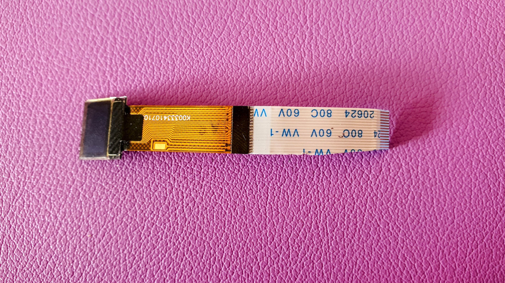
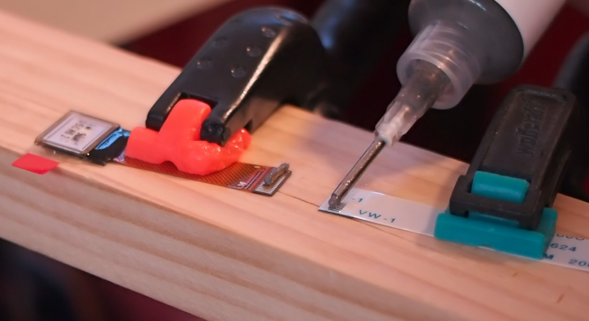
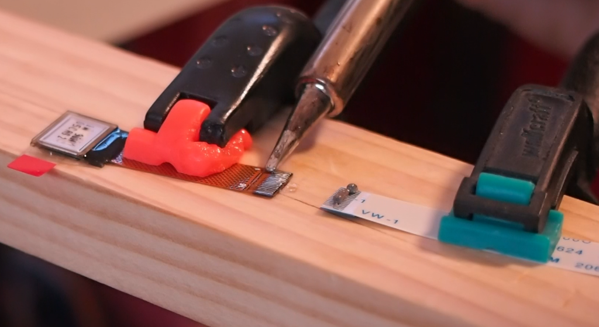
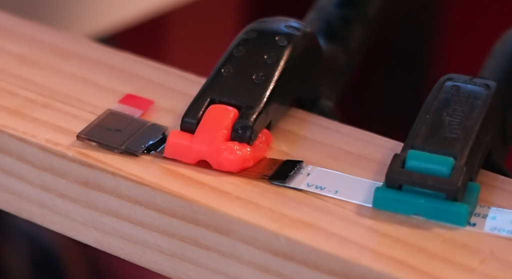
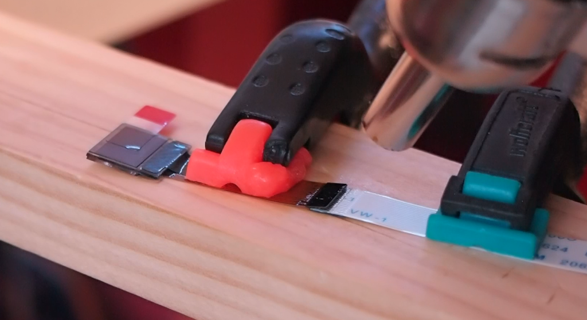
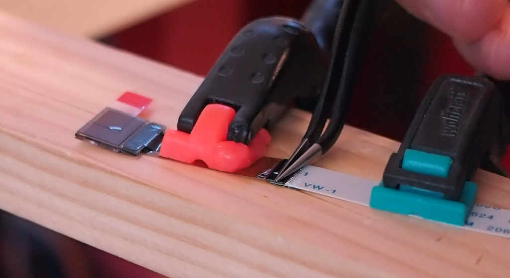

# Making the displays manually

If you are not using the ready-made 0.42 inch displays from the kit, you can make them yourself by
extending a compatible 0.42 inch OLED with a short FPC cable and soldering the two together.

## Parts

Extend *[FPT042W000Z01](https://www.alibaba.com/product-detail/OLED-Display-0-42-Inch-Small_1600693977243.html)
or *[P34107](https://www.alibaba.com/product-detail/OLED-display-OLED-0-42-Inch_1600104997388.html)
with a [30mm FPC cable](https://de.aliexpress.com/item/1005001935872949.html).

> \* I got contacted that these Alibaba links are stale and it turned out that, at the moment, these do
> not work as the displays got removed. Let me keep them in case they come back online. Maybe you can use
> these as an alternative, the pins are compatible:
> [ZJY042-7240TSWPG10](https://www.alibaba.com/product-detail/0-42-inch-72x40-OLED-display_1600820452544.html?spm=a2700.details.0.0.11f34384WPrOet).
> The flex cable is about 1cm shorter, so your extension needs to be 40mm instead of 30mm. I have not
> tried these, so you might wanna do a test first!

The FPC extension should be 14 or 16 pins - blank contacts on the same side, like the two right side
displays on the picture in the main build guide. Only 14 pins are needed; however, you might want to get
a 16 pin FPC and cut away 2 pins to fit the FPC into the 14 pin socket. It is easier to solder 16 pins of
the display together with the 16 pins of the FPC (so the cable aligns), see here:

## Soldering the flex cable

To achieve this, I applied low temperature solder (138 degree C) on both the display FPC pins and the
extension FPC pins with the solder iron:

Then applied some flux on just one side and orientated them straight - don't overlap the pins 100%, leave
some space at the end so that excess solder can have some space to escape:

Next, I used the heat gun with maybe 160 C and heated both sides for a few seconds (you can see the solder
becoming liquid again):

Finally use some tweezers to push the pins together. You will see some solder coming out at the
non-overlapping part of the pins I mentioned to leave out. This is also a good way to see that all pins
have sufficient solder and will connect properly:

Not every display survived this surgery, so better get more from the beginning.
