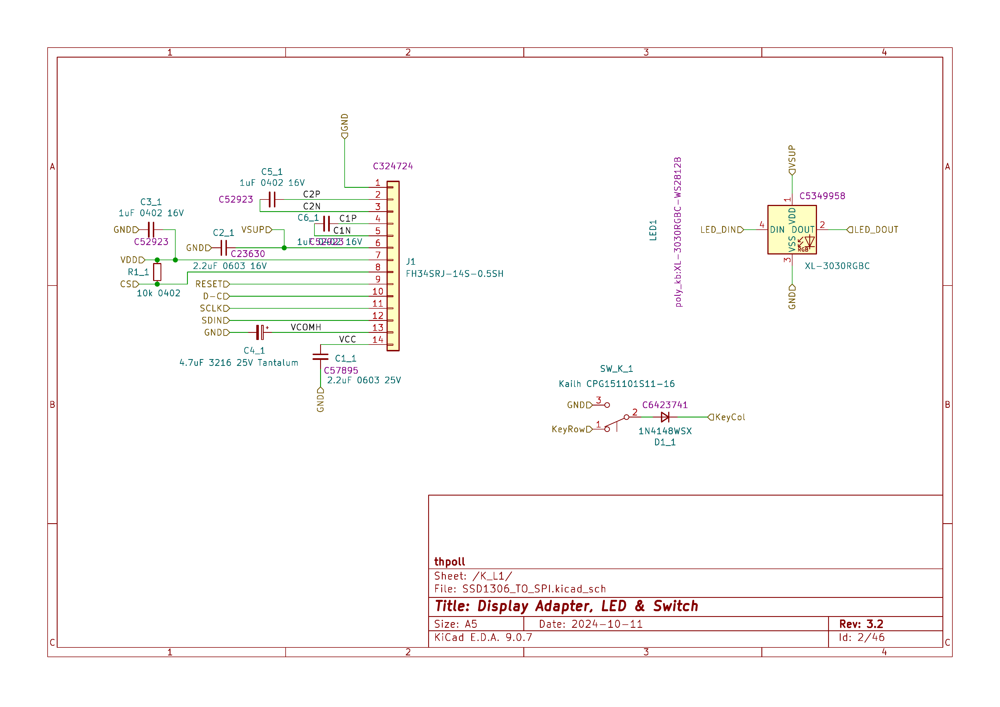

# PolyKybd Split72 — Schematic Sheets

These are the individual schematic sheets of the PolyKybd Split72 (KiCad, Rev 3.2), the same set that
is bundled in the PDF documentation. Repeated per-key and buffer sheets are shown once, since every
instance is identical. The editable source is in the KiCad projects
[`poly_kybd/poly_kybd_split72_left.kicad_pro`](poly_kybd/poly_kybd_split72_left.kicad_pro) /
[`poly_kybd/poly_kybd_split72_right.kicad_pro`](poly_kybd/poly_kybd_split72_right.kicad_pro).

## Left half — root sheet ("PolyKybd Split L")

The top-level sheet of the left-hand board. It ties everything together: the 36 identical key units
(the "Display Adapter, LED & Switch" sub-sheet, one per key), the RP2040 microcontroller block, the
shift-register block, the display charge-pump supply (VSUP) with its current limiter, the USB-C link
between the two halves, and the optional peripherals — the Pimoroni trackball / Cirque trackpad
connector and the optional 0.96" OLED status display.

## Right half — root sheet ("PolyKybd Split72 R")

The top-level sheet of the right-hand board. Structurally the same as the left half — it wires up its
36 key units, the shared control and power nets, and the non-inverting buffer blocks that sit along the
signal chain.

## RP2040 — microcontroller core ("rp2040 base circuit")

The heart of the keyboard. It contains the Raspberry Pi RP2040 (U10) with its decoupling network, the
QSPI flash memory (W25Q64, U9) and BOOT button, the 12 MHz crystal (Y1), and the 3.3 V step-down
regulator (TLV62569, U1) with the SMMS0420 inductor. It also holds the USB-C connector (USB1) with its
ESD protection (TPD4E05, U11) and the VBUS-sense / VSYS network (including the 1N5819WS diode, D2) — so
all the power, USB, clock and boot circuitry lives here.

## Key block — one key unit ("Display Adapter, LED & Switch")

A single key unit, repeated 36× per side. It contains the FH34SRJ FPC socket for the 0.42" OLED display,
the addressable RGB LED (XL-3030RGBC / WS2812B), the MX-compatible Kailh hot-swap switch with its
1N4148 matrix diode, and the local decoupling capacitors — i.e. the display, LED and switch of one key.

## Shift registers ("Shift Registers")

Five 74HC595 8-bit shift registers (U4–U8) daisy-chained together (each `QH'` feeds the next `SER` via
`Carry1`–`Carry4`), driven by the MCU's Data / Clock / Latch lines. They expand a handful of MCU pins
into 40 control outputs used to address the per-key hardware.

## Non-inverting buffer ("ni_buffer2")

A pair of SN74LVC1G126 single non-inverting buffers with 3-state outputs and separate A/B supply rails
(U14, U15). This sheet is instantiated several times (NonInvertingBuffer0…5) to buffer and repeat the
control/data signals as they travel across the large key array, keeping the signal edges clean.
